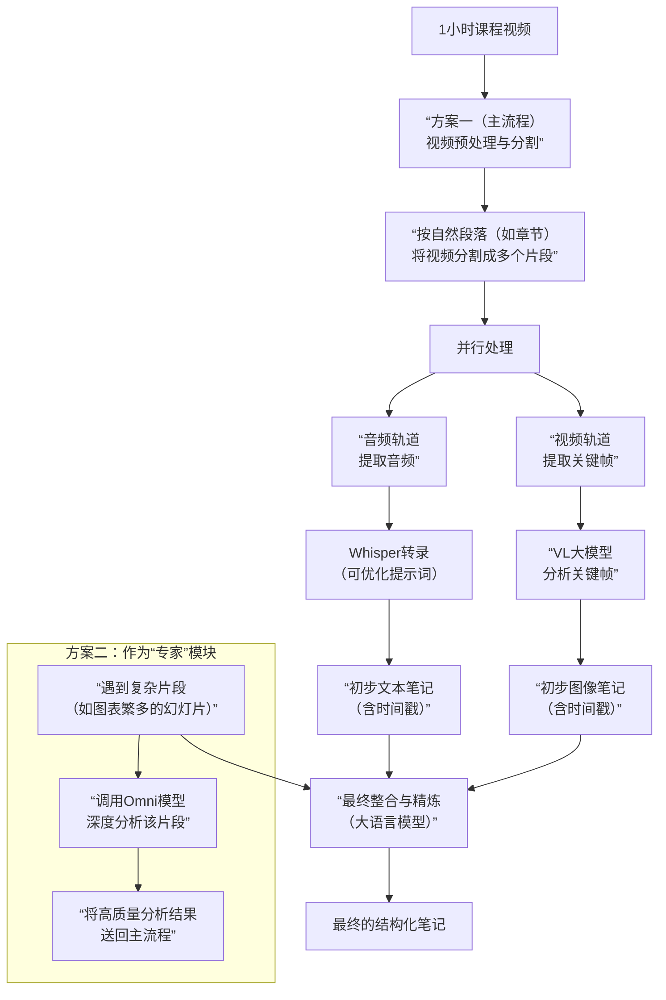

# 我的提问
我有一个长达1小时的课程视频，我希望开发一个工具可以读取视频的图像和音频，自动生成笔记。我有两种方案

1. 图像和音频分离。先使用whisper将视频中的音频转化成文字。转化结果可能存在20%的错误。然后用另一个工具提取视频图像关键帧。比如与上一个关键帧差异超过40%就作为下一个关键帧。或者基于音频内容的时间戳提取关键帧。最后将语音转录文字和关键帧基于时间戳排列，生成pdf，或者交给VL模型进一步理解生成。

2. 直接使用Omni多模态模型。用多模态模型同时识别图像和音频，得到准确的音频转录。并且让omni模型决定哪些图像作为关键帧，告诉我全部关键帧的时间戳，用工具去截取。最后得到准确的转录文字和关键帧，交给VL大模型进一步理解。但是omni模型最多只能观看120秒视频，否则需要超大显存。需要提前分割视频，语义不连贯导致omni模型理解错误。

这两种方法哪个更好？综合生成质量、准确性、速度、成本。

# AI回答
为长视频自动生成笔记是一个很有挑战性也很有价值的任务。下面我帮你梳理这两种方案的优劣，并提供一个更具可行性的混合方案参考。

下面这个表格直观对比了两种方案的核心差异。

| 评估维度 | 方案一：分治策略 (Whisper + 关键帧提取 + VL模型) | 方案二：端到端策略 (Omni多模态模型) | 优劣分析 |
| :--- | :--- | :--- | :--- |
| **生成质量** | 较高。专业化工具各司其职，Whisper转录、关键帧算法、VL模型理解，流程清晰可控。 | **理论上最高**，但受限于上下文长度。模型能直接建立音画联系，生成更贴合视频内容的笔记。 | **方案一在现实中更稳定可靠**。方案二受限于当前技术，对长视频的全局理解能力差。 |
| **准确性** | 中等偏上。依赖Whisper转录准确率（可通过优化提示词和后期校正提升），但音画信息可能脱节。 | **潜在准确性最高，但前提不成立**。需要模型能“看完”足够长的视频片段，否则因语义切割会产生严重误解。 | **方案一的准确性是可实现的最佳结果**。方案二在技术突破前，准确性难以保证。 |
| **速度** | **较快**。各步骤可并行或流水线处理，技术成熟，且Whisper有优化方案。 | **极慢**。需要将1小时视频切成数十个片段，串行调用模型，总耗时呈倍数增长。 | **方案一优势明显**。 |
| **成本/复杂度** | **低**。主要依赖开源模型，计算资源要求相对较低，适合个人开发者。 | **极高**。Omni等大型多模态模型API调用费用高昂，或需要顶级硬件本地部署。 | **方案一在经济和技术门槛上更友好**。 |

### 📊 如何选择：方案一 vs. 方案二

基于以上对比，你可以这样选择：

-   **追求稳定、高效、可控，且愿意接受分步骤处理**：**选择方案一（分治策略）**。这是目前最务实、性价比最高的选择。特别适合个人开发者或创业团队。
-   **追求理论上的最佳效果，且拥有充足的计算资源和时间，愿意尝试前沿技术**：可以**尝试方案二（端到端策略）**，但必须清醒认识到其当前存在的上下文限制和切割语义的风险。

### 💡 更优的混合方案建议

其实，你不必非此即彼地选择。一个更聪明的策略是**取两者之长，形成一个混合方案**，用流程图来展示这个工作流：

这个混合方案的核心思想是：**以稳定、高效的分治策略（方案一）作为主干流程，确保全局效率和控制力；同时，在遇到局部复杂、难以处理的片段时，灵活启用强大的端到端模型（方案二）作为“专家”会诊**。这样既控制住了成本和速度，又在最关键的地方提升了笔记质量。

希望这份详细的分析能帮助你做出最适合自己的技术选型。如果你对其中某个工具或步骤的具体实现感兴趣，我们可以继续深入探讨。